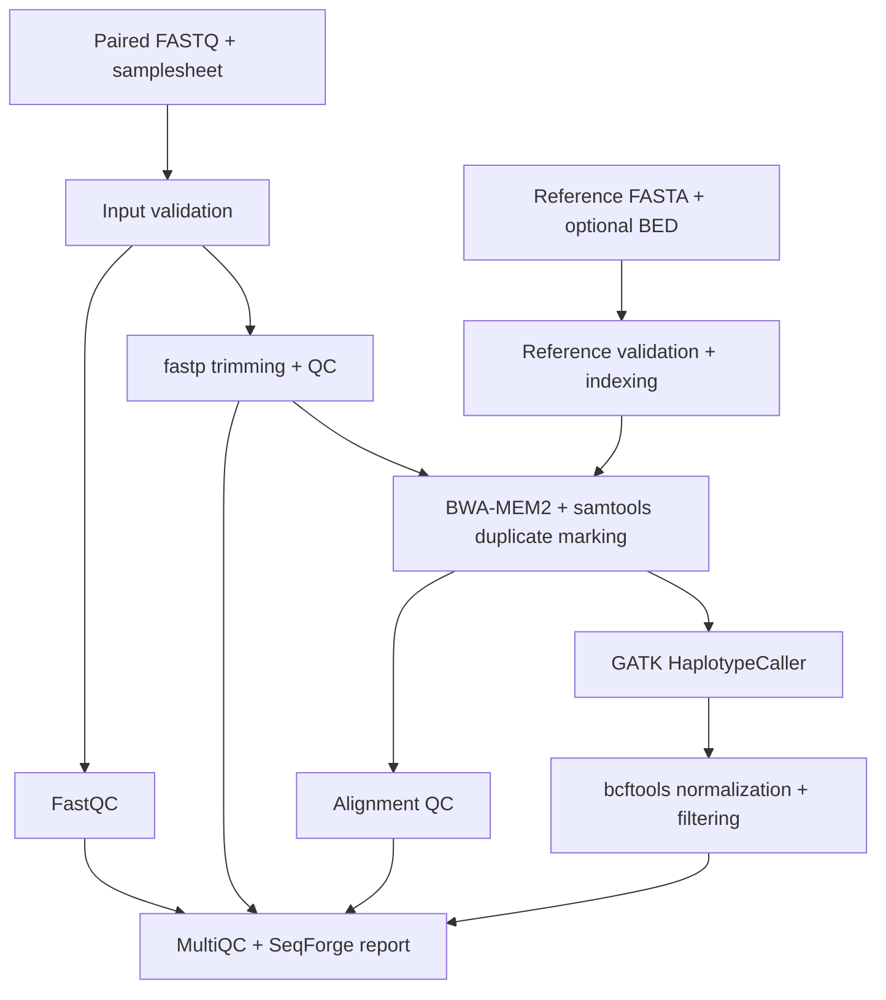

# SeqForge-NGS

**Reproducible germline variant discovery, from paired-end sequencing reads to traceable results.**

[](https://github.com/codewithPauline/SeqForge-NGS/actions/workflows/ci.yml)
[](https://www.nextflow.io/)
[](LICENSE)

SeqForge-NGS is a modular Nextflow workflow for Illumina paired-end germline analysis. It connects read validation, quality control, BWA-MEM2 alignment, duplicate marking, GATK HaplotypeCaller, and variant filtering with reports that make each run inspectable and reproducible.

Built by **Pauline Owusu-Ansah**, Ph.D. researcher in computational and evolutionary genomics at Miami University.

> **Development milestone: working pipeline plus a regional HG002 benchmark.** Automated tests exercise the FASTQ workflow with synthetic samples. A separate human benchmark measures GATK calling and filtering from public alignments. Annotation, full FASTQ-to-VCF human validation, and production qualification remain planned. This is research software, not a clinically validated workflow.

## Measured HG002 results

On **977,839 GIAB v4.2.1 confident bases** within GRCh38 chr20:10,000,001–11,000,000:

| Variant type | Precision | Recall | F1 |
|---|---|---|---|
| SNP | 99.632% | 99.852% | 99.742% |
| INDEL | 96.356% | 96.581% | 96.469% |

These results evaluate **calling and baseline filtering from existing HG002 NovaSeq BWA/Picard alignments**. They do not measure SeqForge's upstream FASTQ processing or alignment, and do not represent genome-wide accuracy. Thresholds were fixed before evaluation; scores include all PASS calls rather than a truth-optimized operating point.

[View the evidence and error counts](benchmarks/evidence/hg002-grch38-chr20/README.md) · [Reproduce the benchmark](docs/benchmark.md)

## What runs today



- **Fail early on bad inputs:** duplicate sample IDs, reused FASTQs, mismatched read names, truncated pairs, and incompatible reference intervals.
- **Keep samples identifiable:** one sample per read pair, explicit read groups, coordinate-sorted and indexed BAMs, and per-sample VCFs.
- **Preserve evidence:** raw VCFs, filter-labeled VCFs, PASS-only VCFs, read/alignment/variant QC, tool versions, reference checksums, and Nextflow execution reports.
- **Run reproducibly:** a Linux package lock with exact builds and checksums, a Docker image recipe, restartable Nextflow tasks, and automated integration checks.
- **Prepare for HPC:** composable Docker, Singularity, and SLURM profiles. Scheduler execution needs local configuration and has not yet been tested on a cluster.

## Run the integration dataset

Requirements: Linux x86-64, Docker, Python 3, and Nextflow **24.10.6** with Java 17. Other Nextflow releases are not yet covered by CI. The fixture is generated locally; no human sequencing download is needed. Allow at least 8 GB RAM. The initial image build downloads substantial tool dependencies; the tiny workflow itself is much smaller.

```bash
git clone https://github.com/codewithPauline/SeqForge-NGS.git
cd SeqForge-NGS
python3 scripts/make_test_data.py
docker build -t seqforge-ngs:0.1.0-dev .
nextflow run main.nf -profile test,docker
```

Open `results-test/reports/seqforge_summary.html` and `results-test/reports/multiqc_report.html`.

To check the resulting BAMs, VCF sample names, expected genotypes, QC, and reports:

```bash
docker run --rm -v "$PWD:$PWD" -w "$PWD" \
  --entrypoint /bin/bash seqforge-ngs:0.1.0-dev \
  -c 'python tests/assert_integration.py'
```

`-profile test` selects small inputs and resources; it **does not** substitute fake tool outputs. With tools installed locally, omit `,docker`. See [installation and usage](docs/usage.md).

## Analyze your own reads

Create a CSV with exactly these columns. Relative FASTQ paths resolve against the CSV's directory:

```csv
sample,fastq_1,fastq_2
SAMPLE01,reads/SAMPLE01_R1.fastq.gz,reads/SAMPLE01_R2.fastq.gz
SAMPLE02,reads/SAMPLE02_R1.fastq.gz,reads/SAMPLE02_R2.fastq.gz
```

```bash
nextflow run main.nf -profile docker \
  --input samplesheet.csv \
  --fasta /data/reference/GRCh38.fa \
  --intervals /data/targets.bed \
  --outdir results
```

The FASTA must be uncompressed; BED coordinates must match its assembly and contig names. Omit `--intervals` to call across the entire supplied reference. The current caller assumes **diploid** sequence. Restrict analysis to appropriate regions: sex chromosomes, mitochondrial DNA, and other ploidies need separate support.

For regional human analyses, align against the appropriate **full reference**, then restrict calling with BED intervals. A cropped reference can distort mapping and is not equivalent to full-genome alignment.

## Outputs at a glance

| Output | Purpose |
|---|---|
| `alignment/*.bam` and `.bai` | Coordinate-sorted, duplicate-marked alignments |
| `variants/raw/*.raw.vcf.gz` | Unfiltered single-sample HaplotypeCaller calls |
| `variants/filtered/*.filtered.vcf.gz` | Normalized records retaining filter labels |
| `variants/filtered/*.pass.vcf.gz` | Records passing the baseline QUAL/depth filter |
| `qc/` | Input validation, FastQC, fastp, samtools, and bcftools metrics |
| `reports/` | MultiQC plus the SeqForge HTML/JSON summary |
| `pipeline_info/` | Reference checksums, software versions, trace, timeline, DAG, and resource report |

The baseline filter marks records with QUAL < 30, sample DP < 10, or missing QUAL/DP. These thresholds are configurable. They are **not** a validated GATK hard-filtering strategy, VQSR, or an accuracy guarantee. BQSR, joint genotyping, and annotation are not implemented in this milestone.

## Verification and roadmap

| Milestone | Status |
|---|---|
| Modular FASTQ → GATK VCF workflow and QC reporting | Implemented |
| Input validation and deterministic two-sample integration fixture | Implemented |
| Docker recipe, Linux dependency lock, and GitHub Actions | Implemented |
| HG002 regional input with matched GIAB truth and confident regions | Implemented, starting from public alignments |
| Genotype-aware SNP/indel benchmarking and published metrics | Implemented with RTG vcfeval |
| Full FASTQ-to-VCF human accuracy benchmark | Planned |
| BQSR and a benchmark-supported filtering strategy | Planned |
| VEP annotation with pinned cache/assembly provenance | Planned |
| Multi-lane samples, scatter/gather, and measured HPC scaling | Planned |
| DeepVariant backend and versioned software release | Planned |

See the [validation overview](docs/validation.md) and [benchmark protocol](docs/benchmark.md) for the scope and evidence behind the regional scores.

## Development and citation

```bash
python3 -m unittest discover -s tests -v
```

CI additionally builds the Docker image, runs the real workflow, checks expected results, and verifies that `-resume` reuses completed tasks. The badge above links to the actual run status.

Use the repository's **Cite this repository** button or [CITATION.cff](CITATION.cff). Until a release is published, cite the commit you used:

> Owusu-Ansah, P. (2026). *SeqForge-NGS: Reproducible germline variant discovery* [Computer software]. GitHub. https://github.com/codewithPauline/SeqForge-NGS. Commit: `<your-commit>`.

SeqForge-NGS code is MIT licensed. Bundled tools retain their own licenses; cite the relevant tool publications when reporting analyses. See [methods and design](docs/methods.md).
